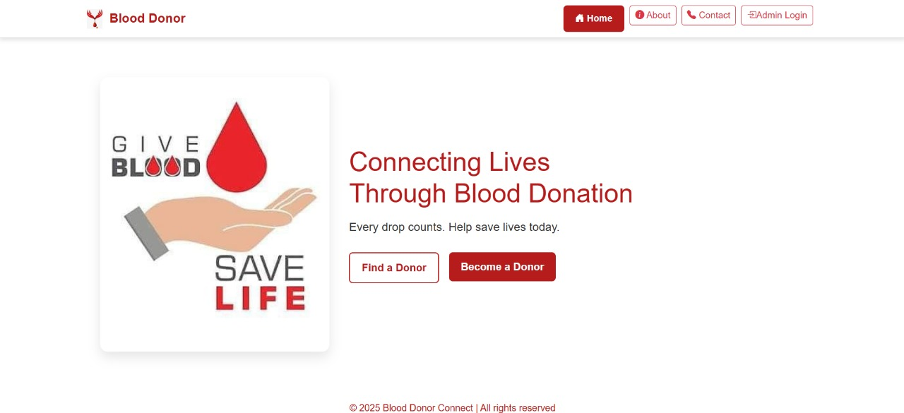
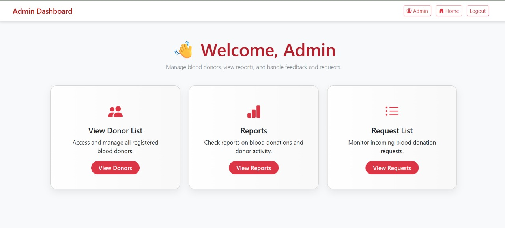
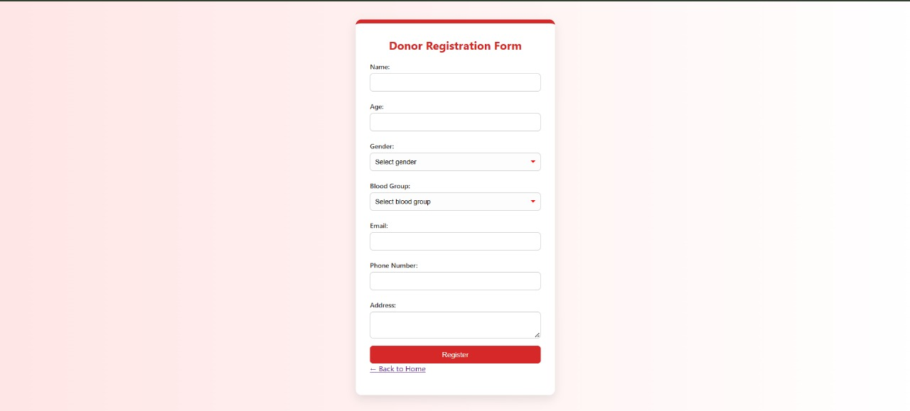
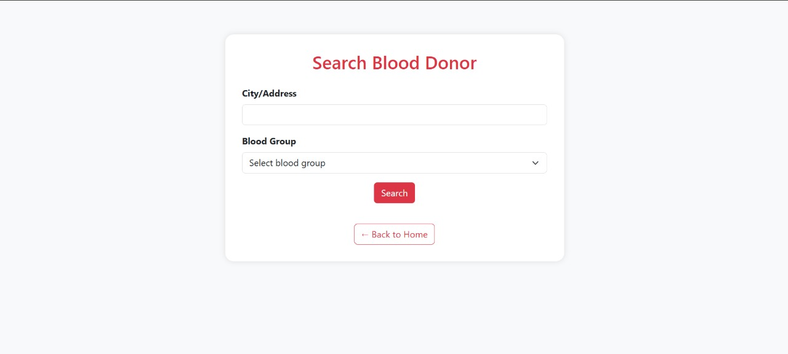
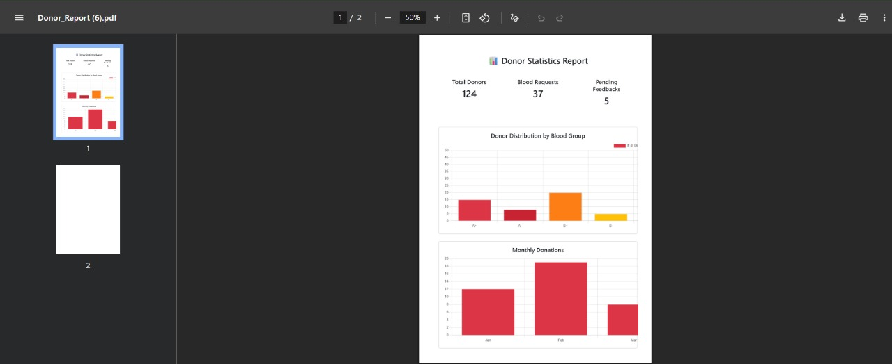
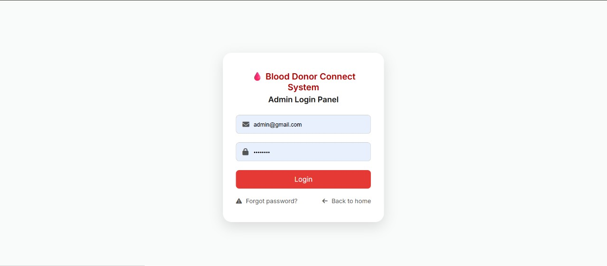

# 🩸 Blood Donor System

A full-featured web-based Blood Donor System that helps donors register, allows users to search for donors by city and blood group, and provides an admin panel to manage donors, requests, feedback, and reports. It includes features like OTP email verification, secure admin login, PDF export, and a clean UI with Bootstrap.

---

## 🌟 Features

- ✅ Donor Registration with client-side validation
- 🔍 Search Donors by City & Blood Group
- 🔐 Admin Login & Forgot Password
- 📤 OTP Email Verification for Donor Authentication
- 🧾 Export Donor List to PDF (FPDF)
- 📝 Feedback & Blood Request Handling
- 📈 Admin Dashboard for viewing and managing data
- 📱 Responsive UI with Bootstrap 5

---

## 🛠 Technologies Used

- **Frontend**: HTML5, CSS3, JavaScript, Bootstrap
- **Backend**: PHP 8+
- **Database**: MySQL
- **Email & OTP**: PHP Mail functions
- **PDF Generation**: [FPDF](http://www.fpdf.org/)

---

## 🗂 Folder Structure

BLOOD_DONOR_SYSTEM/
│
├── admin/
│ ├── admin_dashboard.php
│ ├── admin_login.html/php
│ ├── admin_forgot_password.html
│ ├── admin_redirect.php
│ ├── donor_list.php
│ ├── request_list.php
│ ├── reports.php
│ ├── view_feedback.php
│ ├── send_reset.php
│ ├── logout.php
│ ├── db_config.php
│ ├── test_connection.php
│
├── donor/
│ ├── register.html
│ ├── register.php
│ ├── search.php
│ └── validation.js
│
├── otp/
│ ├── email_verification.html
│ ├── send_otp.php
│ ├── verify_otp.php
│ └── resend_otp.php
│
├── search/
│ ├── search.html
│ ├── search.css
│ ├── search.js
│ └── search.php
│
├── pages/
│ ├── about.html
│ └── contact.html
│
├── fpdf/
│ ├── fpdf.php
│ ├── fpdf.css
│ ├── changelog.htm
│ ├── FAQ.htm
│ ├── install.txt
│ └── license.txt
│
├── assets/
│ ├── css/
│ │ ├── style.css
│ │ ├── admin_login.css
│ │ ├── donars_style.css
│ │ └── email_verification_style.css
│ ├── js/
│ └── images/
│ ├── donation1.jpg
│ └── logo1.jpg
│
├── contact_form.php
├── dashboard.html
├── export_pdf.php
├── index.html
└── README.md

## 🚀 Getting Started

### 1. Clone the Repository

```bash
git clone https://github.com/Likhitha-Poojary/blood_donor_system.git
cd blood_donor_system

###2. Set Up the Database
Open phpMyAdmin

Create a new database called blood_donor_db

Create the following tables (or import the SQL file if available):

📄 Required Tables:
admins – stores admin credentials

donors – stores donor information (name, age, blood group, city, etc.)

search_requests – stores search form queries for tracking and analytics

###3. Configure Database Connection
Edit the file:
📁 admin/db_config.php

Replace with your MySQL credentials:
<?php
$host = "localhost";
$username = "root";
$password = "";
$database = "blood_donor_db";

// Create connection
$conn = new mysqli($host, $username, $password, $database);

// Check connection
if ($conn->connect_error) {
    die("Connection failed: " . $conn->connect_error);
}
?>


Now you can run the app using http://localhost/blood_donor_system in your browser!


###4. 🧪 How to Use the Application
This tells users what each page does and how they can interact with your system.

## 🧪 How to Use the Application

| Functionality            | Page URL/Path                        | Description                              |
|--------------------------|--------------------------------------|------------------------------------------|
| 🏠 Home                  | `/index.html`                        | Landing page for the system              |
| 📝 Register as Donor     | `/donor/register.html`               | Donor fills and submits registration     |
| 🔍 Search Donors         | `/search/search.html`                | Users can search by city & blood group   |
| 🔐 Admin Login           | `/admin/admin_login.html`            | Admin signs in to access dashboard       |
| 📊 Admin Dashboard       | `/admin/admin_dashboard.php`         | Admin can view donors, requests, feedback|
| 🧾 Export Donor List     | `/export_pdf.php`                    | Generates downloadable PDF list          |
| 📨 Email Verification    | `/otp/email_verification.html`       | Donor enters OTP after registration      |
| ❓ Forgot Password       | `/admin/admin_forgot_password.html`  | Sends email link to reset admin password |

###5. 📸 Screenshots









